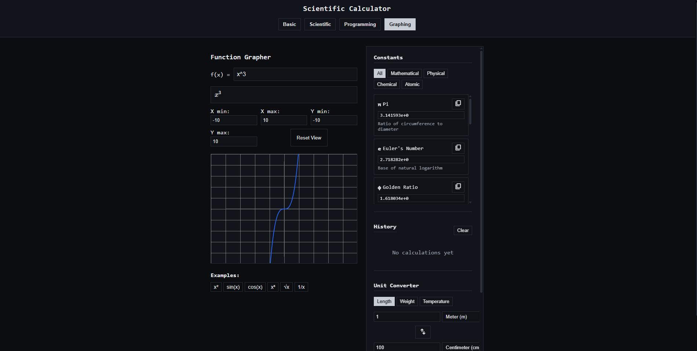

<div align="center">

# Overkill Calculator

[](https://github.com/)
[](https://nodejs.org/)
[](https://npmjs.com/)
[](https://react.dev/)
[]()

**A calculator that does way more than it needs to.**  
Four modes. Panels. Built with React + TypeScript. Because why not.



</div>

---

## Features

| Mode | Description |
|------|-------------|
| **Basic** | Arithmetic that gets out of your way |
| **Scientific** | Trig, logarithms, exponents — the works |
| **Programming** | Hex, binary, octal conversions and bitwise ops |
| **Graphing** | Plot functions visually in real time |

Plus **panels** — contextual sidebars that extend each mode without cluttering the core UI.

---

## Getting Started

### Recommended: Node.js

```bash
npm install
npm start
```

Open [http://localhost:3000](http://localhost:3000) in your browser.

### No Node.js? Serve the pre-built bundle

If a compiled `build/` already exists:

```bash
python -m http.server 4173 --directory build
```

Then visit [http://localhost:4173](http://localhost:4173).

> **Note:** If `npm` is not recognized, Node.js isn't installed or isn't on your PATH.  
> Download it from [nodejs.org](https://nodejs.org/).

---

## Tech Stack

- **React** — component-driven UI
- **TypeScript** — typed, maintainable codebase
- **npm** — dependency & script management

---

## Project Structure

```
overkill-calculator/
├── public/          # Static assets
├── src/
│   ├── components/  # Calculator modes & panels
│   ├── App.tsx      # Root component
│   └── index.tsx    # Entry point
├── build/           # Production build (if compiled)
├── package.json
└── README.md
```

---

## Scripts

| Command | Description |
|---------|-------------|
| `npm install` | Install dependencies |
| `npm start` | Start dev server |
| `npm run build` | Build for production |

---

## License

[MIT © 2026](LICENSE)
